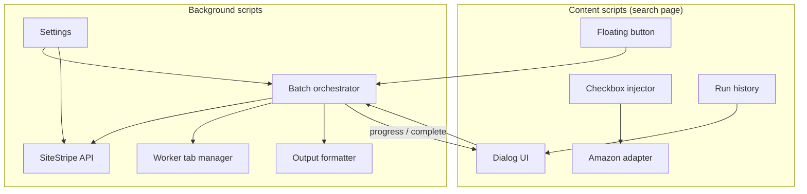

# Architecture

Firefox extension for batch-extracting Amazon SiteStripe affiliate links from search results.

**v1 scope:** `amazon.in` and `amazon.com` search pages, desktop layouts.

---

## Components

### Content scripts (`src/content/`)

Loaded in order via `manifest.json`:

| File | Role |
|------|------|
| `00-namespace.js` | Shared `window.ALB` namespace |
| `01-settings.js` | Settings read/write (`storage.sync`) |
| `02-messaging.js` | Background messaging + batch keepalive |
| `03-amazon-adapter.js` | Search page detection, product card parsing |
| `04-checkbox-injector.js` | Checkbox UI, selection state |
| `05-floating-button.js` | Main action button + history clock icon |
| `06-run-history.js` | Local run log (`storage.local`) |
| `06-dialog.js` | Extract / Output / Failures / History / Settings |
| `07-main.js` | Bootstrap, batch UI wiring |

### Background scripts (`src/background/`)

| File | Role |
|------|------|
| `settings-bg.js` | Settings + auto-save Store/Tracking IDs |
| `format-output-bg.js` | Template formatting for successful links |
| `sitestripe-api-bg.js` | Background `getShortUrl` fetch with cookies |
| `worker-tab.js` | Reusable product tab, page-context API calls |
| `batch-orchestrator.js` | Sequential batch, cancel, retry, progress |
| `service-worker.js` | Message router (`START_BATCH`, `CANCEL_BATCH`, …) |

---

## Extraction paths

### 1. Background API (preferred)

When **Use background API** is enabled and Store ID + Tracking ID are set:

1. Build long URL + MD5 `linkId` (same algorithm as SiteStripe).
2. `fetch('/associates/sitestripe/getShortUrl', { credentials: 'include' })` from the extension background.
3. Uses the user's existing Amazon login cookies in Firefox — the extension does not store cookies.

No product tab opens. Fastest for products 2+ in a batch.

### 2. Worker tab (bootstrap / fallback)

1. Create or reuse one tab navigated to `/dp/{ASIN}`.
2. Activate tab briefly (Firefox throttles inactive tabs).
3. Call SiteStripe's internal `P.when(...)` modules from page context.
4. Fetch `getShortUrl` with page cookies.
5. Restore focus to the search tab after each product.

Required when credentials are not yet saved, or when the background API fails.

On first successful worker extraction, Store ID and Tracking ID are auto-saved to Settings (only if fields were empty).

---

## Batch lifecycle

1. User selects products → clicks floating button (or Shift+click to force re-run).
2. Content script sends `START_BATCH` with product payloads.
3. Orchestrator processes products sequentially with configurable delay.
4. Progress events update dialog + floating button.
5. On complete: formatted output, failures list, run saved to local history.
6. **View results** reopens the latest run for the same selection without re-extracting.

Cancel stops after the current product finishes. Retry failed re-processes only failure entries.

---

## Storage

| Key | API | Contents |
|-----|-----|----------|
| Settings | `browser.storage.sync` | Template, separator, IDs, delays, flags |
| Run history | `browser.storage.local` | Last 20 runs (output, failures, counts) — device only |

No telemetry. No remote servers.

---

## Messaging

Content ↔ background via `browser.runtime.sendMessage`:

- `PING`, `START_BATCH`, `CANCEL_BATCH`
- `BATCH_PROGRESS`, `BATCH_COMPLETE`, `BATCH_ERROR`
- `SETTINGS_UPDATED`

---

## Future extension points

- Additional retailers (new adapter module + host permissions)
- More Amazon page types (category, deals)
- Optional export formats (CSV / JSON)

See [AMAZON_SELECTORS.md](./AMAZON_SELECTORS.md) for DOM selector reference.